# INSTALACIÓN DOCKER DESKTOP EN UBUNTU

## Escritorio ubuntu desktop
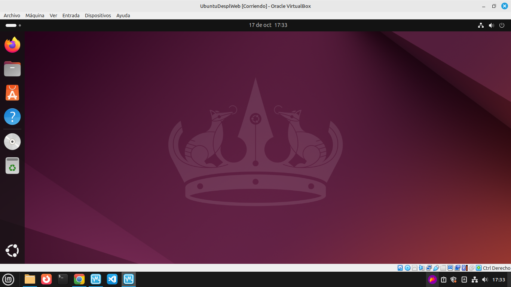  

## Actualiza repositorios

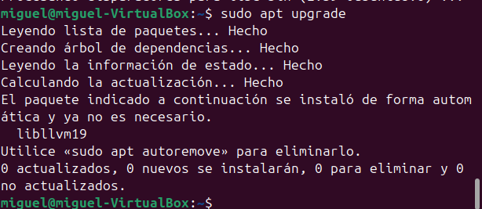  
Se actualizan los paquetes del sistema para asegurar versiones recientes.

---

## INSTALAR DEPENDENCIAS NECESARIAS

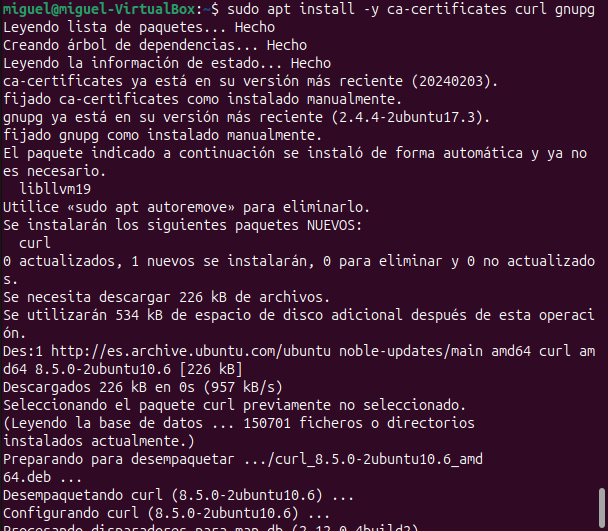  
Se instalan herramientas necesarias como `curl` y certificados.

---

## AGREGAR CLAVE GPG DE DOCKER

  
Se descarga y guarda la clave GPG para verificar la autenticidad de Docker.

---

## AGREGAR REPOSITORIO OFICIAL DE DOCKER

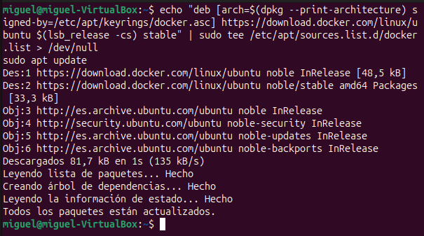  
Se añade el repositorio oficial de Docker a las fuentes de APT.

---

## INSTALAR DOCKER

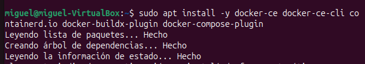  
Se inicia la instalación de Docker y sus componentes principales.

---

## VERIFICAR LA INSTALACIÓN

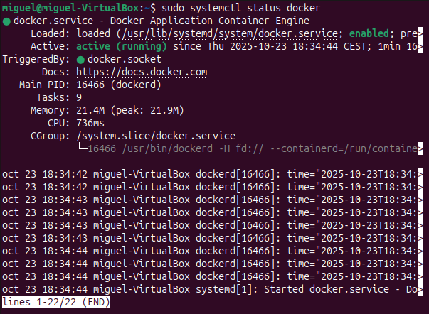  
Docker se descarga desde el repositorio y se instala en el sistema.

---

## PROBAR DOCKER CON UNA IMAGEN DE PRUEBA

  
La instalación se completa sin errores y Docker queda listo para usarse.

---

# INSTALACIÓN DE CONTENEDORES EN SERVIDOR WEB

## BUSCAR IMÁGENES DISPONIBLES

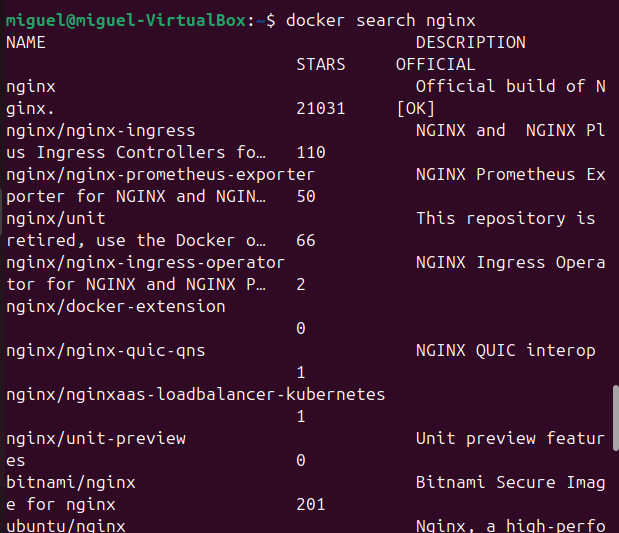  
Se buscan imágenes relacionadas con Nginx en Docker Hub.

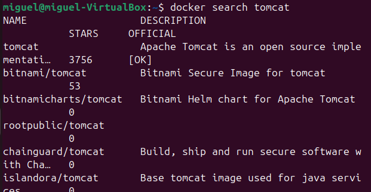  
Se buscan imágenes relacionadas con Tomcat en Docker Hub.

---

## DESCARGAR E INICIAR CONTENEDORES

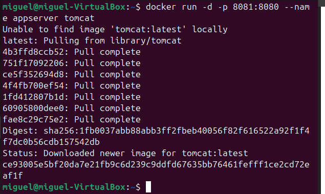  
Se descarga y lanza un contenedor Tomcat en segundo plano.

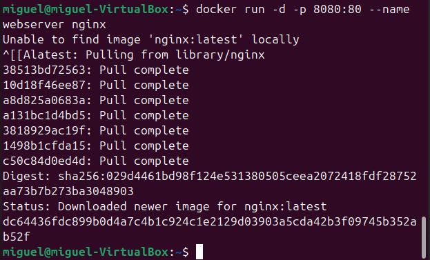  
Se descarga y lanza un contenedor Nginx en segundo plano.

---

## VERIFICAR CONTENEDORES ACTIVOS

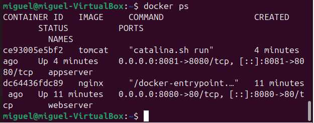  
Se listan los contenedores en ejecución y sus puertos asignados.

---

## ABRIR EN EL NAVEGADOR

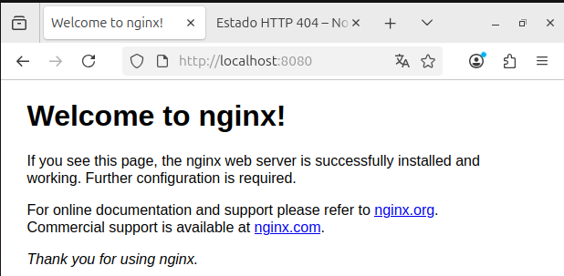  
Se accede al contenedor Nginx desde el navegador y muestra la página por defecto.

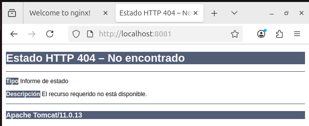  
Se accede al contenedor Tomcat, pero no hay contenido desplegado aún.

## Requerimientos Mínimos para Implantar una Aplicación Web

### Requisitos de Hardware y Software 

#### **Hardware (Servidor)**
 **CPU**  2 núcleos.  
 **RAM**  4 GB.  
 **Almacenamiento**  100 GB SSD.  

#### **Software**
* **Sistema Operativo:** Linux (ej. Ubuntu Server).
* **Lenguaje/Runtime:** Versión estable requerida (ej. Node.js, PHP, Python).
* **Base de Datos:** SGBD adecuado (ej. MySQL, PostgreSQL).

***

### Infraestructura de Red 

* **Direccionamiento:** IP pública estática.
* **DNS:** Configuración del registro 'A' al servidor.
* **Firewall:** Apertura de puertos esenciales (80/HTTP y 443/HTTPS).
* **Opcional/Recomendado:** Uso de CDN (Content Delivery Network).

***

### Configuración del Servidor Web y de Aplicaciones 

* **Servidor Web:** Software (ej. Nginx o Apache) para servir contenido.
* **Virtual Hosts:** Configuración para el dominio específico.
* **Proxy Inverso:** Configuración para conectar el Servidor Web con el Servidor de Aplicaciones (donde corre la lógica).

***

### Seguridad y Mantenimiento 

#### **Seguridad**
* **Cifrado:** Certificado **SSL/TLS** (HTTPS) obligatorio.
* **Parches:** Aplicación constante de parches de seguridad (SO y software).
* **Defensa:** Uso de Firewall y, preferiblemente, WAF (Web Application Firewall).

#### **Mantenimiento**
* **Backups:** Políticas de copia de seguridad automática (BD y archivos).
* **Monitorización:** Herramientas para vigilar el rendimiento (CPU, RAM, errores).
* **Logs:** Gestión de registros para análisis y detección de fallos.
