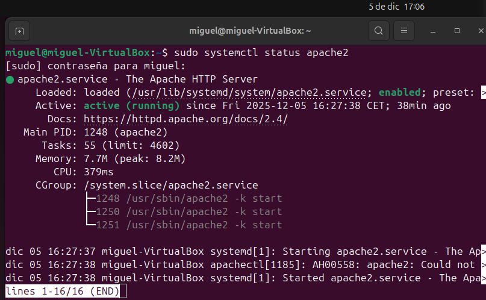
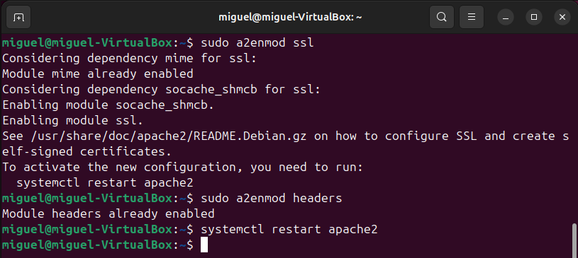
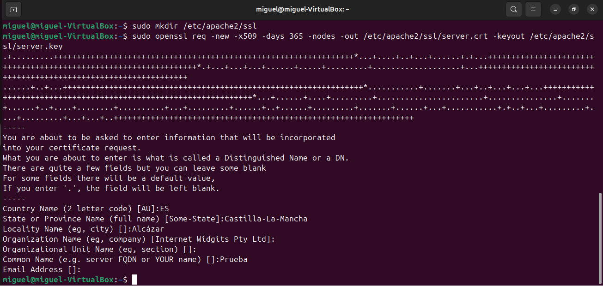
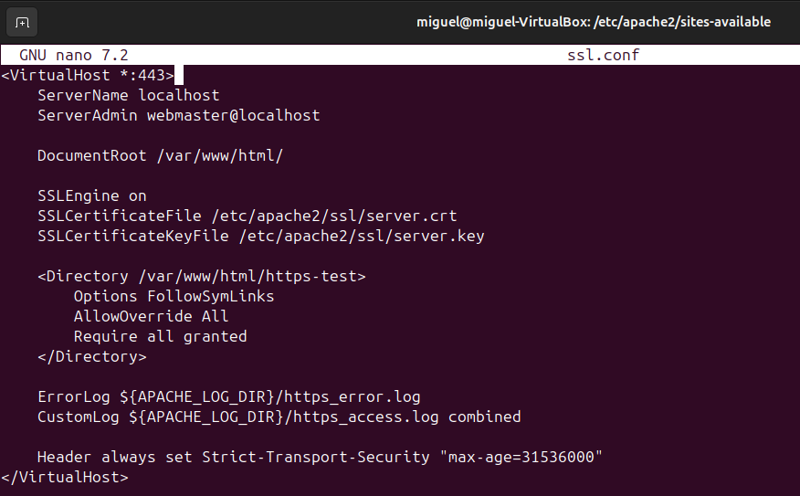
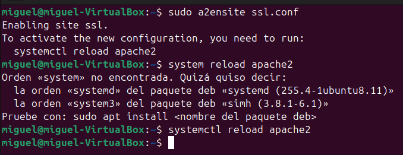
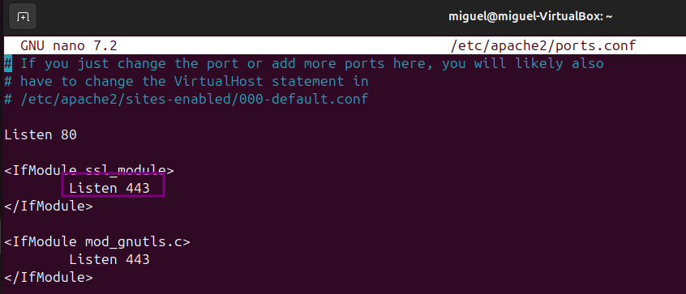
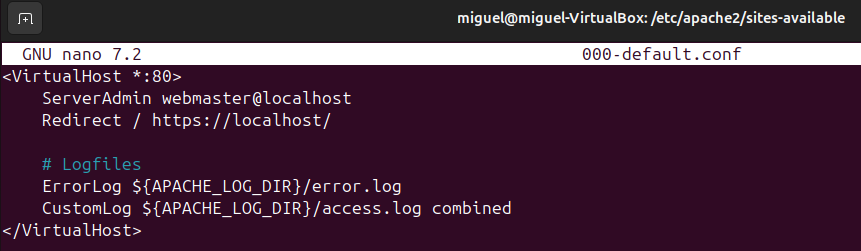
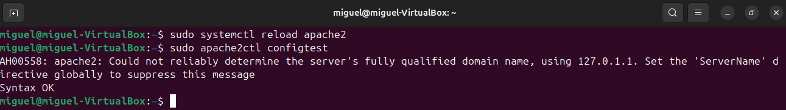
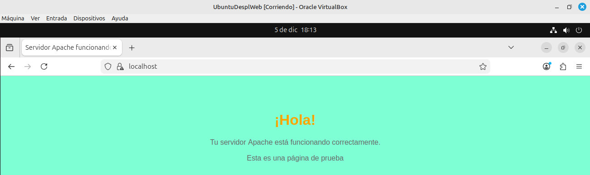
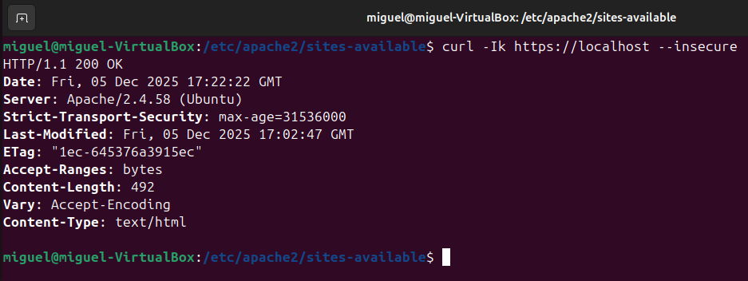

# APACHE HTTPS

## 1. INVESTIGACIÓN

### 1.1. FUNCIONAMIENTO DEL PROTOCOLO HTTPS
HTTPS funciona añadiendo una capa de seguridad (SSL/TLS) al protocolo HTTP, cifrando la comunicación entre tu navegador y el sitio web para que los datos, como contraseñas o información bancaria, viajen ilegibles para terceros, usando un par de claves (pública y privada) para encriptar y desencriptar la información, asegurando que sea privada y auténtica.

### 1.2. TIPOS DE CERTIFICADOS SSL/TLS
El certificado digital es la pieza central que permite el cifrado y la autenticación.  
Los certificados SSL/TLS permiten cifrar la comunicación entre un cliente (como un navegador) y un servidor web. Existen distintos tipos, pero una distinción clave es certificados autofirmados vs. certificados emitidos por una Autoridad de Certificación (CA).

#### Certificados Autofirmados
Un certificado creado y firmado por la misma entidad que lo usa (por ejemplo, tú mismo en tu servidor).

**Características:**
- No son emitidos por terceros confiables.
- Los navegadores los marcan como no seguros, ya que no pueden verificar la identidad del sitio.
- Se usan principalmente para entornos internos o pruebas (desarrollo, intranet).

**Ventajas:**
- Son gratuitos.
- Fácil de crear.

**Desventajas:**
- No son confiables para usuarios externos.
- Generan advertencias de seguridad.
- No sirven para sitios públicos.

#### Certificados emitidos por una CA confiable
Certificados emitidos por una Autoridad de Certificación (Certificate Authority), como Let's Encrypt, DigiCert.

**Características:**
- Firmados digitalmente por una entidad reconocida y confiable.
- Los navegadores los aceptan sin advertencias.
- Usados en producción para sitios accesibles públicamente.

**Ventajas:**
- Reconocidos y confiables por navegadores y dispositivos.
- Dan confianza a usuarios.
- Validan la identidad del servidor.

**Desventajas:**
- Algunos son de pago (aunque existen gratuitos como Let's Encrypt).
- Algunos requieren verificación del dominio e incluso empresa.

---

## 2. EJECUCIÓN TÉCNICA

### 2.1. INSTALAR Y VERIFICAR ESTADO DE APACHE2

### 2.2. HABILITAR SSL Y HEADERS
Habilito el SSL y los headers, después reinicio apache2.  

### 2.3. GENERACIÓN CERTIFICADO SSL/TLS

#### A. Certificado autofirmado
Creo el directorio para los certificados y genero certificado autofirmado (válido por 365 días):  

### 2.4. CONFIGURAR VIRTUALHOST HTTPS
Creo el archivo de configuración del SSL.  

Habilito el sitio:  

Verifico que escuche al puerto 443:  

Redirijo de HTTP a HTTPS:  

Recargo apache:  

Validar funcionamiento:  

Me ha advertido de que es HTTPS:  

Hacemos un `curl -Ik`:  

---

## Conclusiones
- Apache2 fue instalado y funcionando, confirmando su correcto estado mediante `systemctl` y `configtest`, lo que asegura una base estable para la comunicación web.
- Se habilitaron correctamente los módulos SSL y headers, necesarios para manejar conexiones cifradas y aplicar políticas de seguridad.
- Se generó un certificado autofirmado, ideal para pruebas internas y entornos de desarrollo. Aunque no sea reconocido por navegadores, el cifrado se aplica correctamente y sirve para validar configuración.
- Se creó y configuró un VirtualHost para el puerto 443, indicando la ubicación del certificado, carpeta raíz y permisos correctos, garantizando que Apache maneje HTTPS.
- No fue necesario Certbot, ya que el enfoque fue completamente manual, permitiendo control total sobre el proceso y comprensión más profunda del funcionamiento de SSL/TLS en Apache.
- La estructura de archivos quedó ordenada y funcional, con el documento de prueba verificando el servicio HTTPS de manera exitosa.
- La configuración se probó desde navegador y `curl`, confirmando que los certificados fueron cargados y que el sitio responde por HTTPS como se esperaba.
