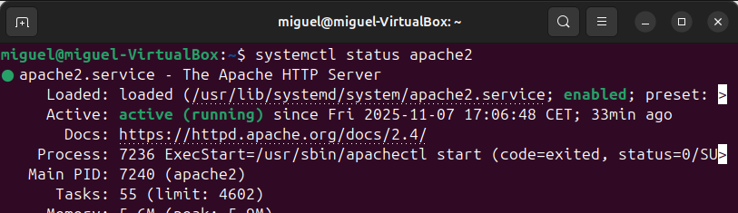
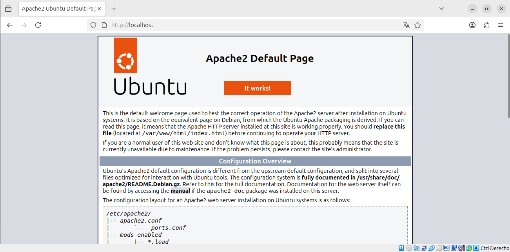
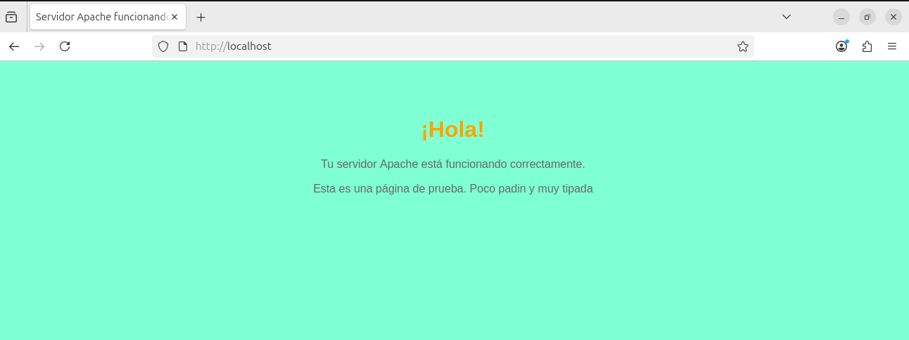
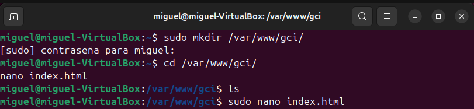
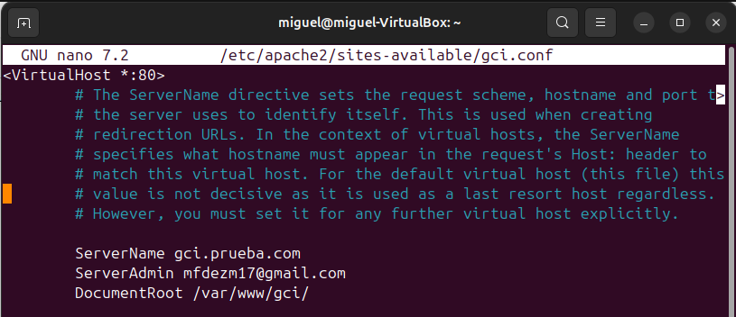
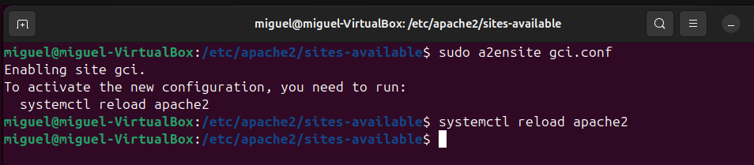
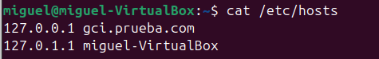
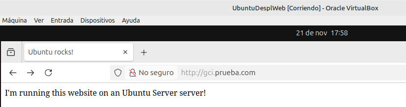
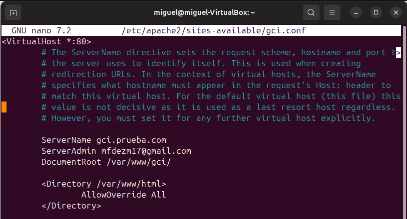

# Servidor Web Apache: Introducción y Aplicaciones Básicas

## Resumen
Este documento presenta una introducción al servidor web Apache, describiendo su contexto de uso, las actividades realizadas, los resultados obtenidos y las conclusiones finales.  
Incluye instalación, configuración básica y control de acceso mediante `.htaccess`, siguiendo el tutorial oficial de Ubuntu y pruebas realizadas en local.

## Palabras clave
Apache, servidor web, HTTP, hosting, código abierto, Nginx, IIS, Ubuntu

---

# 1. Introducción

## 1.1 Contexto
Se utiliza Apache HTTP Server en un entorno de prácticas con Ubuntu Server 24.04, donde se instala, configura y prueba el servicio para alojar páginas web.

---

## 1.2 Qué es Apache
Apache HTTP Server es un servidor web de código abierto.  
Su función principal es comunicar servidores y navegadores mediante HTTP/HTTPS, gestionando peticiones y sirviendo recursos.

---

## 1.3 Alternativas
- Nginx  
- Microsoft IIS  
- LiteSpeed  

---

## 1.4 Motivación
El objetivo de este proyecto es comprender el funcionamiento de un servidor web y aprender a configurarlo para alojar sitios web seguros.  
Apache se elige por su facilidad de instalación y amplia documentación.

---

# 2. Cuerpo de la memoria

## 2.1 Instalación del servidor Apache
Se siguió el tutorial oficial de Ubuntu:  
https://ubuntu.com/tutorials/install-and-configure-apache#2-installing-apache

Se instaló Apache en Ubuntu Desktop 24.04.  

### Comprobación del estado del servicio

### Comprobación en el navegador

---

## 2.2 Creación de un sitio web sencillo
Se creó un sitio web básico con HTML dentro de `/var/www/html`.

---

## 2.3 Configuración de Virtual Hosts
Todos los pasos del punto 3 del tutorial de Ubuntu fueron completados.

---

## 2.4 Archivo de configuración de VirtualHost
Se ajustaron los parámetros del archivo `.conf` correspondiente.

---

## 2.5 Activación del VirtualHost
Se añadió el dominio al archivo `/etc/hosts`.

El dominio funciona sin certificado, pero con HTTPS no se logró finalizar la configuración.

---

## 2.6 Configuración de `.htaccess`
Se configura el archivo htaccess

---

## 2.7 Generación del archivo de contraseñas

---

## 2.8 Permisos para que `.htaccess` funcione
Se habilitó `AllowOverride All`.

---

# 3. Presentación y valoración de resultados

El servidor Apache quedó instalado y configurado correctamente.  
Los Virtual Hosts funcionan correctamente.  
La configuración HTTPS no se consiguió completar.

---

## Valoración
Apache es estable, sencillo de configurar y excelente para aprender.  
Su comunidad y documentación son amplias, aunque puede ser menos eficiente que Nginx en alto tráfico.

---

# 4. Conclusión
Apache demuestra ser ideal para entornos educativos de administración de servidores web.  
Es estable, versátil y bien documentado.

---

# 5. Bibliografía

- Apache HTTP Server Project — https://httpd.apache.org  
- Sumo Logic Blog — https://www.sumologic.com/blog/apache-web-server-introduction  
- Neterra Blog — https://blog.neterra.cloud  
- Wikipedia — https://es.wikipedia.org/wiki/Servidor_HTTP_Apache  

