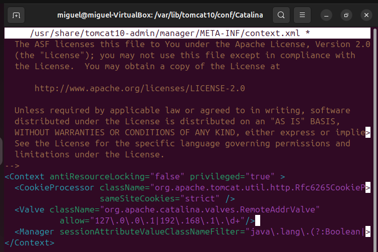
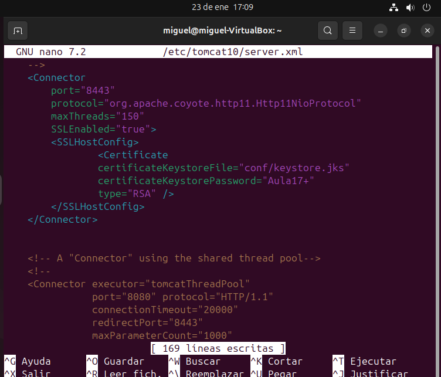
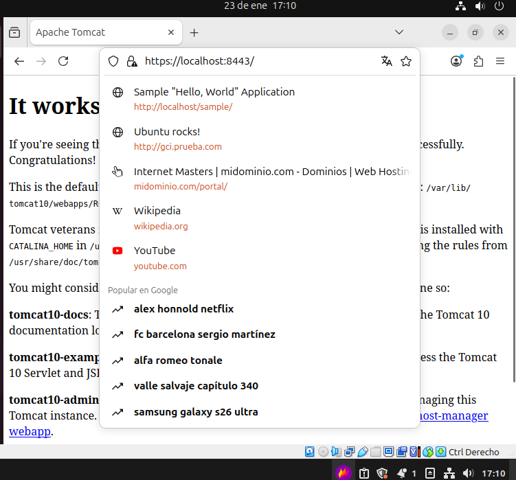
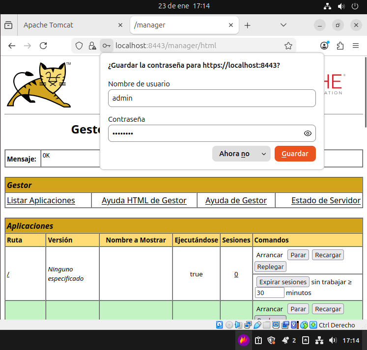

# Acceso Autenticado en Tomcat 10 (Ubuntu)

## 1. Definición de Usuarios y Roles
Archivo: `conf/tomcat-users.xml`

<tomcat-users>
    <role rolename="manager-gui"/>
    <role rolename="manager-script"/>

    <user username="admin"
          password="admin123"
          roles="manager-gui,manager-script"/>
</tomcat-users>

## 2. Restricción de Acceso al Manager
Archivo: `webapps/manager/META-INF/context.xml`

<Context privileged="true">
    <Valve className="org.apache.catalina.valves.RemoteAddrValve"
           allow="127\.0\.0\.1|::1"/>
</Context> 

## 3. Configuración de HTTPS
### 3.1. Creación del KeyStore

keytool -genkeypair \
-alias tomcat \
-keyalg RSA \
-keysize 2048 \
-keystore conf/keystore.jks \
-validity 365

### 3.2. Conector SSL
Archivo: `conf/server.xml`

## 4. Reinicio del servidor TomCat
sudo systemctl restart tomcat

## 5. Prueba de Acceso
Acceso seguro:
https://localhost:8443

Acceso al Manager:
https://localhost:8443/manager/html

Credenciales:

Usuario: admin
Contraseña: admin123

## 6. Conclusión
El acceso al Manager de Tomcat 10 queda protegido mediante autenticación por roles y comunicación cifrada HTTPS, cumpliendo los requisitos básicos de seguridad.
