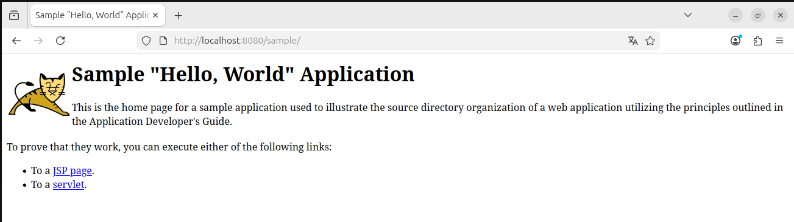

# Práctica: Despliegue de un archivo WAR de ejemplo en Apache Tomcat

## 1. Descarga del archivo WAR de ejemplo

1. Acceder a la página oficial de Apache Tomcat.
2. Descargar el archivo de ejemplo proporcionado por Tomcat: sample.war
3. Guardar el archivo en el equipo local.

Este archivo WAR contiene una aplicación de ejemplo utilizada para verificar el correcto funcionamiento del servidor Tomcat.

---

## 2. Despliegue del archivo WAR en la carpeta webapps

1. Localizar la carpeta de instalación de Tomcat.
2. Acceder al directorio: TOMCAT_HOME/webapps/
3. Copiar el archivo `sample.war` dentro de la carpeta `webapps`.
4. Iniciar o reiniciar el servidor Tomcat:
   - Windows: `startup.bat`
   - Linux / macOS: `startup.sh`

---

## 3. Despliegue automático realizado por Tomcat

Al iniciarse el servidor, Tomcat detecta automáticamente el archivo `sample.war` en la carpeta `webapps` y ejecuta internamente los siguientes pasos:

1. Detecta la presencia del archivo WAR en el directorio `webapps`.
2. Descomprime el archivo `sample.war`, creando la carpeta `sample/`.
3. Lee el archivo de configuración `WEB-INF/web.xml`.
4. Inicializa el contexto de la aplicación.
5. Asigna la ruta de acceso `/sample`.
6. Registra la aplicación dentro del contenedor web.
7. Deja la aplicación preparada para recibir peticiones HTTP.

### Referencia explícita a los logs

Este proceso puede comprobarse en el archivo de registro principal de Tomcat: TOMCAT_HOME/logs/catalina.out
En dicho archivo se observan mensajes como:
- Inicio del servidor
- Despliegue del contexto `/sample`
- Inicialización correcta de la aplicación

---

## 4. Acceso a la aplicación desplegada

1. Abrir un navegador web.
2. Introducir la siguiente URL: http://localhost:8080/sample
3. Se mostrará la página de ejemplo incluida en el archivo `sample.war`.

Esto confirma que el despliegue se ha realizado correctamente.

---

## 5. Evidencia del funcionamiento (captura de pantalla)

Muestra de la evidencia del acceso correcto a la aplicación desplegada:

