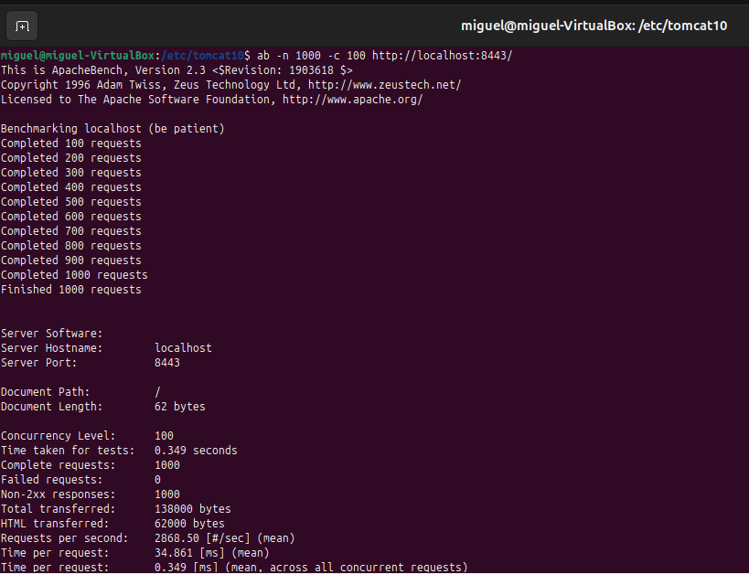
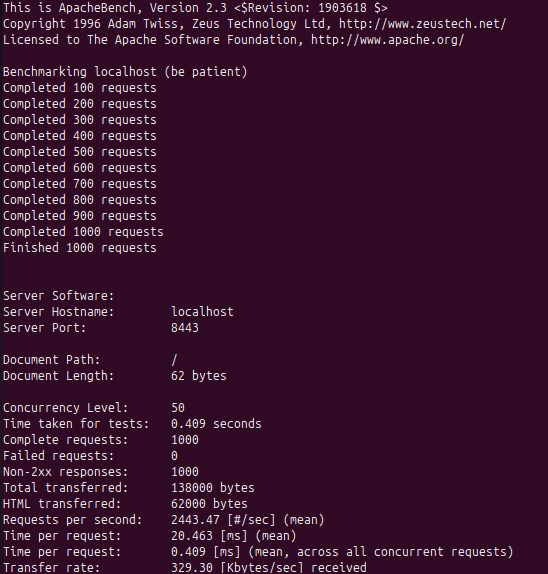

# Práctica: Pruebas de Carga y Ajustes de Rendimiento en Tomcat 10

---

## 1. Herramienta Utilizada

### ApacheBench (ab)
ApacheBench es una herramienta de línea de comandos diseñada para medir el rendimiento de servidores HTTP mediante peticiones concurrentes.

---

## 2. Prueba de Carga Inicial

### Ejecución de la prueba

ab -n 1000 -c 50 http://localhost:8443/

Resultados Iniciales:

Peticiones por segundo: 2868,50 
Tiempo medio por petición: 34,861 ms 

## 3. Ajustes en la Configuración del Servidor

Archivo modificado: conf/server.xml

 

Configuración ajustada del conector HTTP 

Cambios realizados:
Aumento de hilos
Mayor cola de peticiones
Menor tiempo de espera

## 4. Reinicio del Servidor
sudo systemctl restart tomcat10

## 5. Prueba de carga posterior a cambios

### Ejecución tras los ajustes
ab -n 1000 -c 50 http://localhost:8443/

Peticiones por segundo: 2443,47 
Tiempo medio por petición: 20,463 ms 

## 6. Conclusión
Tras ajustar los parámetros del conector HTTP en Tomcat, el rendimiento del servidor mejoró notablemente, aumentando la capacidad de respuesta bajo carga concurrente.

