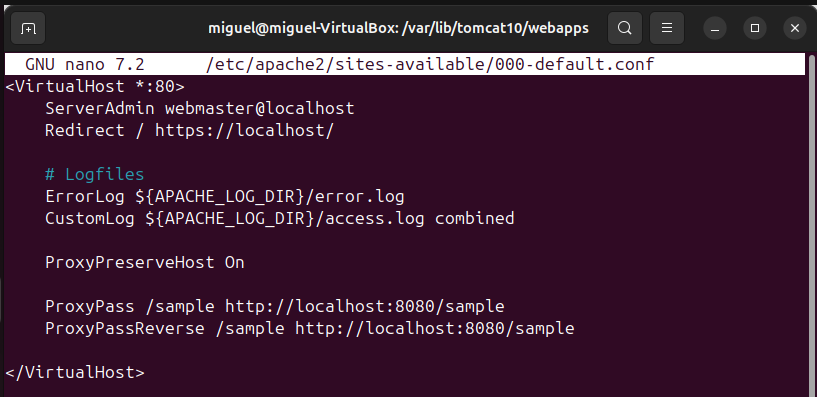
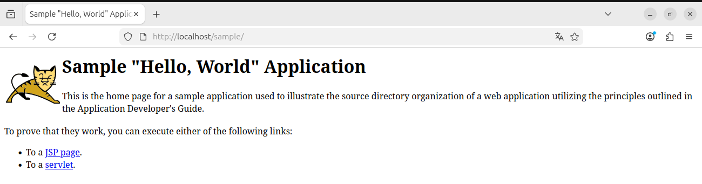

## 1. Instalación de Apache HTTP Server

### Comprobación previa
Verificar si Apache está instalado:
apache2 -v

Si no está instalado:
sudo apt update
sudo apt install apache2

Verificar que el servicio esté activo:
sudo systemctl status apache2

Acceder desde el navegador a:
http://localhost

Si aparece la página por defecto de Apache, la instalación es correcta.

## 2. Composición de TomCat en ejecución
Verificar que Tomcat funciona correctamente:
sudo systemctl status tomcat

Acceder directamente a Tomcat para comprobar la aplicación:
http://localhost:8080/sample

## 3. Configuración de Apache como Reverse Proxy hacia Tomcat
### Habilitar módulos necesarios
sudo a2enmod proxy
sudo a2enmod proxy_http

Reiniciamos apache2 para aplicar cambios:
sudo systemctl restart apache2

### Configuración del VirtualHost
Editar el archivo de configuración por defecto:
sudo nano /etc/apache2/sites-available/000-default.conf

Añadir dentro de este archivo:

ProxyPreserveHost On  
ProxyPass /sample http://localhost:8080/sample  
ProxyPassReverse /sample http://localhost:8080/sample  

Guardar cambios y reiniciamos Apache:
sudo systemctl restart apache2

## 4. Acceso a la applicación a través de Apache (sin usar el puerto de Tomcat)
Abrir navegador y acceder a:
http://localhost/sample
La App debe mostrarse sin indicar el puerto 8080

Captura de prueba del funcionamiento

