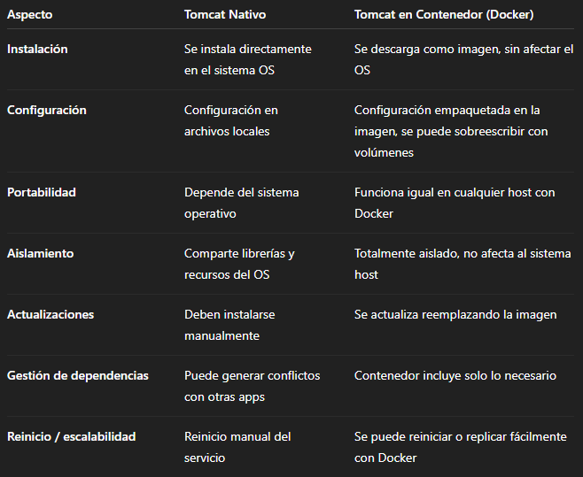

# Tomcat con Docker y comparación con Tomcat nativo

## 1. Descargar la imagen oficial de Tomcat

Para obtener la última versión oficial de Tomcat desde Docker Hub:

```bash
docker pull tomcat:latest
```
## 2. Ejecutar TOMCAT en Docker

Para correr TomCat en un contenedor de manera sencilla:

docker run -it --name mi-tomcat -p 8080:8080 tomcat:latest

-it → modo interactivo con terminal. 

--name mi-tomcat → nombre del contenedor. 

-p 8080:8080 → mapea el puerto 8080 del contenedor al 8080 del host, para acceder desde el navegador. 

Después de ejecutar esto, Tomcat debería estar corriendo y accesible en:
http://localhost:8080

## 3. Montar una aplicación en /usr/local/tomcat/webapps

Para añadir una aplicación .war al Tomcat del contenedor:

# 1. Coloca tu archivo .war (por ejemplo mi-app.war) en un directorio local, por ejemplo:

/home/usuario/tomcat-apps/

# 2. Monta el directorio local dentro del contenedor usando la opción -v: 
docker run -it --name mi-tomcat \
  -p 8080:8080 \
  -v /home/usuario/tomcat-apps:/usr/local/tomcat/webapps \
  tomcat:latest
Ahora Tomcat detectará automáticamente mi-app.war y lo desplegará.

Puedes verificar que la aplicación está activa visitando:

http://localhost:8080/mi-app

## 4. Diferencias entre Tomcat nativo y Tomcat en contenedor



Resumen:
Tomcat en Docker ofrece portabilidad, aislamiento y facilidad de despliegue, mientras que Tomcat nativo depende del sistema operativo y requiere más mantenimiento manual.
