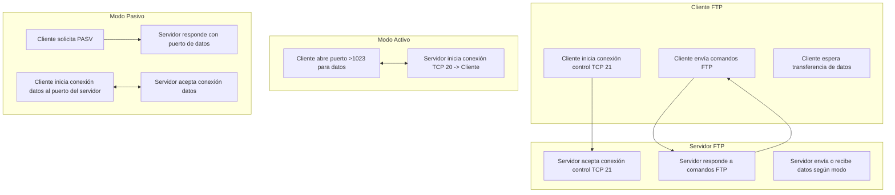

# Flujo de Conexión entre cliente y servidor FTP

```mermaid
flowchart TB
    subgraph Cliente FTP
        C1[Cliente inicia conexión control TCP 21]
        C2[Cliente envía comandos FTP]
        C3[Cliente espera transferencia de datos]
    end

    subgraph Servidor FTP
        S1[Servidor acepta conexión control TCP 21]
        S2[Servidor responde a comandos FTP]
        S3[Servidor envía o recibe datos según modo]
    end

    %% Conexión de control
    C1 --> S1
    C2 --> S2
    S2 --> C2

    %% Modo Activo
    subgraph ModoActivo[Modo Activo]
        C3A[Cliente abre puerto >1023 para datos]
        S3A[Servidor inicia conexión TCP 20 -> Cliente]
        C3A <--> S3A
    end

    %% Modo Pasivo
    subgraph ModoPasivo[Modo Pasivo]
        C3P[Cliente solicita PASV]
        S3P[Servidor responde con puerto de datos]
        C3P --> S3P
        C3P_2[Cliente inicia conexión datos al puerto del servidor]
        S3P_2[Servidor acepta conexión datos]
        C3P_2 <--> S3P_2
    end
```
